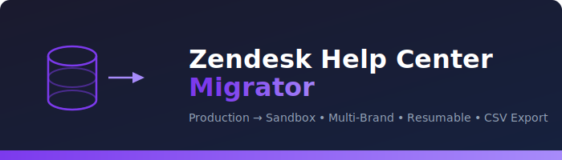

<p align="center">
  
</p>

<h1 align="center">Zendesk Help Center Migrator</h1>

<p align="center">
  <strong>Production → Sandbox migration tool for multi-brand Zendesk Help Centers</strong>
</p>

<p align="center">
  <a href="#features">Features</a> •
  <a href="#architecture">Architecture</a> •
  <a href="#quickstart">Quickstart</a> •
  <a href="#configuration">Configuration</a> •
  <a href="#usage">Usage</a> •
  <a href="#csv-export">CSV Export</a> •
  <a href="#troubleshooting">Troubleshooting</a>
</p>

---

## Overview

A Python CLI tool that migrates an entire Zendesk Help Center — **brands, categories, sections, articles, translations, and inline attachments** — from a production instance to a sandbox environment. Built for multi-brand Zendesk setups where each brand has its own Help Center subdomain.

### Why this tool?

Zendesk sandboxes don't provide a native one-click way to copy Help Center content from production. Manual recreation is tedious and error-prone, especially across multiple brands. This tool automates the full migration pipeline while handling Zendesk API quirks like brand-scoped subdomains, required permission groups, rate limits, and pagination.

---

## Features

| Feature | Description |
|---|---|
| **Multi-brand aware** | Reads from each brand's subdomain in production; writes to the shared sandbox subdomain |
| **Full hierarchy** | Migrates brands → categories → sections → articles in dependency order |
| **Translations** | Migrates non-default locale translations for categories, sections, and articles |
| **Inline attachments** | Downloads article body images from production, re-uploads to sandbox, rewrites URLs |
| **CSV export** | Saves all production data locally as CSV files (per-resource + combined master file) |
| **Resumable** | Saves an ID mapping file after every object — re-run to pick up where you left off |
| **Dry-run mode** | Preview what would be created without writing anything to the sandbox |
| **Credential testing** | Validates API tokens, permissions, and Help Center access before migrating |
| **Rate-limit aware** | Throttles to 80 RPM with automatic retry and exponential backoff on 429s |
| **Detailed error logging** | Parses Zendesk error responses (error, message, details, field-level validations) |
| **ID mapping report** | JSON file mapping every production ID to its sandbox counterpart |

---

## Architecture

### Migration Pipeline

```
┌─────────────────────────────────────────────────────────────────┐
│                    MIGRATION PIPELINE                            │
├─────────────────────────────────────────────────────────────────┤
│                                                                 │
│  Phase 0: CREDENTIAL TEST                                       │
│  ┌─────────────────────────────────────────────────────────┐    │
│  │  • Auth check (/api/v2/users/me)                        │    │
│  │  • Account info & plan verification                     │    │
│  │  • Brands API access                                    │    │
│  │  • Help Center API access                               │    │
│  │  • Sandbox write test (create + delete temp category)   │    │
│  └─────────────────────────────────────────────────────────┘    │
│                           │                                     │
│                     PASS? ▼ FAIL → abort                        │
│                                                                 │
│  Phase 1: BRANDS                                                │
│  ┌─────────────────────────────────────────────────────────┐    │
│  │  Production ──GET /api/v2/brands──▶ Match by name or    │    │
│  │                                     create in sandbox   │    │
│  │  Captures brand subdomain mappings for later phases     │    │
│  └─────────────────────────────────────────────────────────┘    │
│                           │                                     │
│                           ▼                                     │
│  Phase 2: CATEGORIES (per brand)                                │
│  ┌─────────────────────────────────────────────────────────┐    │
│  │  For each brand:                                        │    │
│  │    Read:  brand_subdomain.zendesk.com/api/v2/           │    │
│  │           help_center/categories                        │    │
│  │    Write: sandbox_subdomain.zendesk.com/api/v2/         │    │
│  │           help_center/categories                        │    │
│  └─────────────────────────────────────────────────────────┘    │
│                           │                                     │
│                           ▼                                     │
│  Phase 3: SECTIONS (per brand → per category)                   │
│  ┌─────────────────────────────────────────────────────────┐    │
│  │  For each brand:                                        │    │
│  │    Read:  brand_subdomain/help_center/sections          │    │
│  │    Write: sandbox/help_center/categories/{id}/sections  │    │
│  │    Handles nested parent_section_id references          │    │
│  └─────────────────────────────────────────────────────────┘    │
│                           │                                     │
│                           ▼                                     │
│  Phase 4: ARTICLES (per brand → per section)                    │
│  ┌─────────────────────────────────────────────────────────┐    │
│  │  For each brand:                                        │    │
│  │    Read:  brand_subdomain/help_center/articles          │    │
│  │    Write: sandbox/help_center/sections/{id}/articles    │    │
│  │    • Fetches sandbox permission_group_id (required)     │    │
│  │    • Fetches sandbox user_segment_id (required)         │    │
│  │    • Migrates inline attachment images                  │    │
│  │    • Migrates non-default translations                  │    │
│  └─────────────────────────────────────────────────────────┘    │
│                           │                                     │
│                           ▼                                     │
│  Phase 5: CSV EXPORT                                            │
│  ┌─────────────────────────────────────────────────────────┐    │
│  │  Saves to hc_csv_export/:                               │    │
│  │    • brands.csv                                         │    │
│  │    • categories.csv                                     │    │
│  │    • sections.csv                                       │    │
│  │    • articles.csv (includes full HTML body)             │    │
│  │    • help_center_all.csv (master flat file)             │    │
│  └─────────────────────────────────────────────────────────┘    │
│                           │                                     │
│                           ▼                                     │
│  ┌─────────────────────────────────────────────────────────┐    │
│  │  SUMMARY: Created / Skipped / Failed counts per type    │    │
│  │  OUTPUTS: migration_id_mapping.json, migration.log      │    │
│  └─────────────────────────────────────────────────────────┘    │
│                                                                 │
└─────────────────────────────────────────────────────────────────┘
```

### Multi-Brand API Strategy

Zendesk's Help Center API requires brand-specific subdomains for reading content in multi-brand setups, but sandbox environments share a single account subdomain. This tool handles the asymmetry:

```
PRODUCTION (Read)                         SANDBOX (Write)
──────────────────                        ──────────────────
brand1.zendesk.com ──────┐
brand2.zendesk.com ──────┤  ──────▶  yourcompany1234.zendesk.com
brand3.zendesk.com ──────┤                (single subdomain)
brand4.zendesk.com ──────┘

Each brand has its own                All brands share the
HC subdomain for reads                sandbox account subdomain
```

### Data Flow

```
Production Zendesk                          Sandbox Zendesk
┌──────────────────┐                       ┌──────────────────┐
│                  │   Brand matching       │                  │
│  Brand A ●───────┼───────────────────────▶│  Brand A ●       │
│  ├─ Category 1   │   ID mapping          │  ├─ Category 1   │
│  │  ├─ Section 1 │   (prod→sand)         │  │  ├─ Section 1 │
│  │  │  ├─ Art 1  │                       │  │  │  ├─ Art 1  │
│  │  │  └─ Art 2  │                       │  │  │  └─ Art 2  │
│  │  └─ Section 2 │                       │  │  └─ Section 2 │
│  └─ Category 2   │                       │  └─ Category 2   │
│                  │                       │                  │
│  Brand B ●───────┼──────────────────────▶│  Brand B ●       │
│  └─ ...          │                       │  └─ ...          │
└──────────────────┘                       └──────────────────┘
         │
         ▼
  Local CSV Export
  ┌──────────────────┐
  │ hc_csv_export/   │
  │  brands.csv      │
  │  categories.csv  │
  │  sections.csv    │
  │  articles.csv    │
  │  help_center_    │
  │    all.csv       │
  └──────────────────┘
```

### Error Handling & Retry Logic

```
  API Request
      │
      ▼
┌──────────┐    Yes    ┌─────────────┐
│ HTTP 429 │──────────▶│ Wait Retry- │──┐
│ (Rate    │           │ After secs  │  │
│  Limit)  │           └─────────────┘  │
└──────────┘                            │
      │ No                              │
      ▼                                 │
┌──────────┐    Yes    ┌─────────────┐  │
│ HTTP 5xx │──────────▶│ Exponential │──┤
│ (Server) │           │ backoff     │  │
└──────────┘           └─────────────┘  │
      │ No                              │
      ▼                            Retry│
┌──────────┐    Yes    ┌──────────┐    │
│ HTTP 4xx │──────────▶│ Log full │    │
│ (Client) │           │ error    │    │
└──────────┘           │ detail   │    │
      │ No             └──────────┘    │
      ▼                                │
┌──────────┐           ┌──────────┐    │
│ HTTP 2xx │           │ Max      │◀───┘
│ Success  │           │ retries? │
└──────────┘           │ → abort  │
                       └──────────┘
```

---

## Quickstart

### Prerequisites

- **Python 3.8+**
- **Zendesk API tokens** for both production and sandbox (Admin role recommended)
- **Help Center enabled** on all brands in both environments
- **`requests`** library

### Installation

```bash
# Clone the repository
git clone https://github.com/mohdasim/Zendesk-Help-Center-Migrator.git
cd Zendesk-Help-Center-Migrator

# Install dependencies
pip install -r requirements.txt
```

### Minimal Setup

```bash
# Set credentials via environment variables
export ZD_PROD_SUBDOMAIN="yourcompany"
export ZD_PROD_EMAIL="admin@yourcompany.com"
export ZD_PROD_TOKEN="your_production_api_token"

export ZD_SAND_SUBDOMAIN="yourcompany1234567890"
export ZD_SAND_EMAIL="admin@yourcompany.com"
export ZD_SAND_TOKEN="your_sandbox_api_token"

# Test credentials first
python zendesk_hc_migration.py --test-only

# Preview what would be migrated
python zendesk_hc_migration.py --dry-run

# Run the full migration
python zendesk_hc_migration.py
```

---

## Configuration

### Environment Variables

| Variable | Required | Description |
|---|---|---|
| `ZD_PROD_SUBDOMAIN` | Yes | Production Zendesk subdomain (e.g., `yourcompany` from `yourcompany.zendesk.com`) |
| `ZD_PROD_EMAIL` | Yes | Admin email for production |
| `ZD_PROD_TOKEN` | Yes | API token for production |
| `ZD_SAND_SUBDOMAIN` | Yes | Sandbox Zendesk subdomain (e.g., `yourcompany1774596529`) |
| `ZD_SAND_EMAIL` | Yes | Admin email for sandbox |
| `ZD_SAND_TOKEN` | Yes | API token for sandbox |
| `ZD_DRY_RUN` | No | Set to `true` for preview mode (default: `false`) |

### Script Configuration

Edit the `CONFIG` dictionary in `zendesk_hc_migration.py` for granular control:

```python
CONFIG = {
    # Toggle individual migration phases
    "migrate_brands":       True,
    "migrate_categories":   True,
    "migrate_sections":     True,
    "migrate_articles":     True,
    "migrate_translations": True,
    "migrate_attachments":  True,

    # CSV export
    "export_csv":       True,
    "csv_output_dir":   "hc_csv_export",

    # Rate limiting
    "requests_per_minute": 80,    # Zendesk allows 100 RPM for token auth
    "retry_max":           5,     # Max retry attempts per request
    "retry_backoff_base":  2,     # Exponential backoff base (seconds)

    # Output files
    "mapping_file":     "migration_id_mapping.json",
    "log_file":         "migration.log",
}
```

### Finding Your Subdomains

**Production subdomain**: Look at your Zendesk URL — `https://yourcompany.zendesk.com` → subdomain is `yourcompany`

**Sandbox subdomain**: Go to **Admin Center → Sandbox → Sandboxes**, click your sandbox, and note the URL. It's typically `yourcompany` followed by a numeric ID, e.g., `yourcompany1774596529`

**Brand subdomains** (multi-brand): Go to **Admin Center → Account → Brand Management → Brands**. Each brand shows its subdomain. The migration tool auto-detects these from the API.

### Generating API Tokens

1. Go to **Admin Center → Apps and Integrations → APIs → Zendesk API**
2. Click **Add API token**
3. Give it a description (e.g., "HC Migration Tool")
4. Copy the token — it's only shown once
5. Repeat for the sandbox instance

---

## Usage

### Run Modes

```bash
# 1. Test credentials only — validates auth, permissions, HC access
python zendesk_hc_migration.py --test-only

# 2. Dry run — tests creds + shows what would be migrated (no writes)
python zendesk_hc_migration.py --dry-run

# 3. Full migration — tests creds + migrates everything + exports CSV
python zendesk_hc_migration.py

# 4. Using a .env file (with a helper like direnv or dotenv)
source .env && python zendesk_hc_migration.py
```

### Using a .env File

Create a `.env` file in the project root:

```env
ZD_PROD_SUBDOMAIN=yourcompany
ZD_PROD_EMAIL=admin@yourcompany.com
ZD_PROD_TOKEN=abc123def456
ZD_SAND_SUBDOMAIN=yourcompany1774596529
ZD_SAND_EMAIL=admin@yourcompany.com
ZD_SAND_TOKEN=xyz789uvw012
```

Then source it before running:

```bash
source .env
python zendesk_hc_migration.py --test-only
```

### Resuming a Failed Migration

The tool saves progress after every object in `migration_id_mapping.json`. If a migration is interrupted (network error, rate limit, Ctrl+C), simply re-run the same command — it will skip already-migrated objects and continue from where it left off.

To **start fresh**, delete the mapping file:

```bash
rm migration_id_mapping.json
python zendesk_hc_migration.py
```

---

## CSV Export

Phase 5 automatically exports all production Help Center data to local CSV files:

### Output Files

```
hc_csv_export/
├── brands.csv              # All brands with IDs, subdomains, HC status
├── categories.csv          # Categories with brand_id, description, locale
├── sections.csv            # Sections with category_id, parent_section_id
├── articles.csv            # Articles with full HTML body, labels, vote stats
└── help_center_all.csv     # Combined master file — all objects in one table
```

### Column Reference

**articles.csv** — the most detailed export:

| Column | Description |
|---|---|
| `id` | Production article ID |
| `title` | Article title |
| `locale` | Article locale (e.g., `en-us`) |
| `section_id` | Parent section ID |
| `body` | Full article HTML body |
| `label_names` | Semicolon-separated label list |
| `promoted` | Whether the article is promoted |
| `draft` | Whether the article is a draft |
| `vote_sum` / `vote_count` | Helpfulness vote stats |
| `created_at` / `updated_at` | Timestamps |
| `sandbox_id` | Corresponding sandbox article ID (populated after migration) |

**help_center_all.csv** — flat hierarchy view:

| Column | Description |
|---|---|
| `type` | `brand`, `category`, `section`, or `article` |
| `id` | Production ID |
| `name_or_title` | Name (brands/categories/sections) or title (articles) |
| `parent_id` | ID of the parent object |
| `parent_type` | Type of the parent (`brand`, `category`, `section`) |
| `sandbox_id` | Mapped sandbox ID |

---

## Output Files

After a successful migration, you'll have:

```
project-root/
├── migration_id_mapping.json   # Full prod→sandbox ID mapping
├── migration.log               # Detailed execution log
└── hc_csv_export/
    ├── brands.csv
    ├── categories.csv
    ├── sections.csv
    ├── articles.csv
    └── help_center_all.csv
```

### ID Mapping Format

```json
{
  "brands": {
    "34364962466455": 39337000001234
  },
  "categories": {
    "34365098881175": 39337000005678
  },
  "sections": {
    "34365160001943": 39337000009012
  },
  "articles": {
    "34365234567890": 39337000003456
  },
  "attachments": {}
}
```

---

## Troubleshooting

### Common Errors

#### `404 Not Found` on categories/sections/articles

**Cause**: Multi-brand Zendesk requires brand-specific subdomains for Help Center API reads. The tool handles this automatically by reading each brand's subdomain from the Brands API.

**Fix**: Ensure Help Center is **enabled** on all brands in both production and sandbox.

#### `400 Bad Request` on article creation

**Cause**: Zendesk requires `permission_group_id` and `user_segment_id` when creating articles via API.

**Fix**: The tool automatically fetches these from the sandbox. Ensure at least one permission group and user segment exist in your sandbox (they're created by default when Help Center is enabled).

#### `400 Bad Request` on translations

**Cause**: The tool tried to create a translation for the default locale, which already exists.

**Fix**: v1.0+ automatically detects and skips the default locale translation using multiple detection methods.

#### `429 Too Many Requests`

**Cause**: Zendesk API rate limit exceeded.

**Fix**: The tool automatically waits for the `Retry-After` period and retries. You can lower `requests_per_minute` in CONFIG if you're hitting this frequently.

#### `401 Unauthorized`

**Cause**: Invalid API token or email.

**Fix**: Run `--test-only` to verify credentials. Ensure the email and token are for an **Admin** account, and the token format is `email/token:api_token`.

### Error Log Format

All API errors are logged with full diagnostic detail:

```
[SAND] ┌── API ERROR ──────────────────────────────────
[SAND] │ Request : POST https://sandbox.zendesk.com/api/v2/help_center/sections/123/articles
[SAND] │ Status  : 400 Bad Request
[SAND] │ Error   : RecordInvalid
[SAND] │ Message : Record validation errors
[SAND] │ Detail  : permission_group_id → [{'description': 'is required', 'error': 'BlankError'}]
[SAND] │ Payload : {"article": {"title": "My Article", "body": "<p>...</p>", ...}}
[SAND] │ Req ID  : abc123-def456
[SAND] └───────────────────────────────────────────────
```

### Debug Mode

The log file (`migration.log`) captures DEBUG-level output with full API call traces. Check it for detailed diagnostics:

```bash
# Follow the log in real-time
tail -f migration.log

# Search for failures
grep "FAIL\|ERROR\|API ERROR" migration.log
```

---

## Project Structure

```
Zendesk-Help-Center-Migrator/
├── README.md                      # This file
├── LICENSE                        # MIT License
├── requirements.txt               # Python dependencies
├── .env.example                   # Example environment variables
├── .gitignore                     # Git ignore rules
├── zendesk_hc_migration.py        # Main migration script
└── docs/
    └── banner.svg                 # Project banner image
```

---

## Limitations

- **User IDs**: Article `author_id` is not preserved (sandbox may have different user IDs). Articles are created under the authenticated user.
- **Article attachments**: Only inline images referenced in the article HTML body are migrated. Standalone file attachments on articles are not migrated.
- **Community posts**: Zendesk Community (posts, topics) is not included in this migration.
- **Themes**: Help Center themes and customizations are not migrated (these are managed separately in Zendesk Guide).
- **Content tags**: Article content tags are not migrated (use `label_names` instead).
- **User segments**: Articles are assigned the sandbox's default user segment. Custom user segment rules are not replicated.
- **Concurrent writes**: The tool uses last-write-wins. Don't run multiple instances simultaneously against the same sandbox.

---

## Contributing

1. Fork the repository
2. Create a feature branch (`git checkout -b feature/my-feature`)
3. Commit your changes (`git commit -am 'Add my feature'`)
4. Push to the branch (`git push origin feature/my-feature`)
5. Open a Pull Request

---

## License

This project is licensed under the MIT License — see the [LICENSE](LICENSE) file for details.

---

<p align="center">
  Built for multi-brand Zendesk operations
</p>
